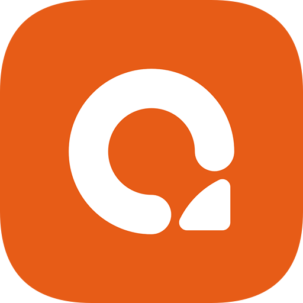

<p align="center">
  
</p>

<h1 align="center">Akaun</h1>

<p align="center">
  A self-hosted expense, income, and reimbursement tracker for small teams and freelancers.
</p>

## What is Akaun?

Akaun is a small web app for keeping track of money in and out of a business or household: expenses, income, who paid for what, and which expenses still need to be reimbursed. You run it yourself — on your own server, NAS, or VPS — and your financial data never leaves your machine.

Instead of typing every receipt in by hand, you can snap a photo or upload a scan and Akaun will read the amount, date, and supplier off it automatically (OCR), suggest a matching contact, and flag anything that looks like a duplicate before it's saved.

## Why self-host?

- **Your data stays yours** — everything lives in a single SQLite file and a local folder you control, no third party has access to it.
- **No subscription** — run it once on hardware you already own.
- **Small footprint** — designed to run comfortably on a low-power VPS, a Raspberry Pi, or a home NAS.

## Key Features

- **Expenses & Income** — record transactions with amounts, dates, categories, and linked contacts.
- **Receipt/Invoice Import (OCR)** — upload a photo or PDF and Akaun extracts the details for you, with fuzzy contact matching and duplicate detection.
- **Reimbursement Claims** — group a batch of expenses into a claim for approval and repayment.
- **Contacts Directory** — one shared list of suppliers, customers, and employees, reused across expenses and income.
- **Roles & Permissions** — invite teammates and control exactly what each person/group can view, add, edit, or delete.
- **Real-time Updates** — changes made by one person (or in another browser tab) show up instantly for everyone else, no refresh needed.
- **PDF Export** — generate printable summaries of claims and records.

## Screenshots

<!-- TODO: add screenshots once available (dashboard, expenses list, OCR import, claim detail) -->

## Self-Hosting with Docker (recommended)

The easiest way to run Akaun is with Docker. This is the recommended path even if you're not very technical — once Docker is installed, it's three steps.

**1. Install [Docker](https://docs.docker.com/get-docker/)** (includes Docker Compose on recent versions).

**2. Create a folder for Akaun and a `docker-compose.yml` inside it:**

```yaml
services:
  akaun:
    image: ghcr.io/akaun-app/akaun:latest
    restart: unless-stopped
    ports:
      - 6969:6969
    volumes:
      - ./data:/app/data
    environment:
      - ORIGIN=http://localhost:6969
      - PUID=1000 # Set to $(id -u) to match your host user
      - PGID=1000 # Set to $(id -g) to match your host group
      - BODY_SIZE_LIMIT=15M
      # - ADMIN_PASSWORD=  # Only read on first boot to seed the admin account password
      # - LOG_LEVEL=info
      # - SSL_ENABLED=true
      # - SSL_KEY_PATH=/app/data/ssl/key.pem
      # - SSL_CERT_PATH=/app/data/ssl/cert.pem
```

**3. Start it:**

```sh
docker compose up -d
```

Akaun is now running at `http://localhost:6969` (or your server's address, if `ORIGIN` is updated to match). All data — the database and any uploaded files — is stored in the `./data` folder next to your `docker-compose.yml`, so back up that folder to back up your whole instance.

**First login:** an `admin` account is created automatically on first boot. If you didn't set `ADMIN_PASSWORD` in the compose file, check the container logs once (`docker compose logs akaun`) for the randomly generated password — it's only printed the first time.

**Running behind a different port, domain, or with HTTPS:** see the commented-out variables above and `.env.example` in this repo for details on every option.

## Manual / From-Source Setup

For developers who'd rather run Akaun directly with [Bun](https://bun.sh):

```sh
git clone https://github.com/akaun-app/akaun.git
cd akaun
bun install
bun run build
bun server.js
```

Configure the app via environment variables (copy `.env.example` to `.env` and edit, or export them directly):

| Variable          | Default             | Purpose                                                    |
| ----------------- | ------------------- | ----------------------------------------------------------- |
| `DATABASE_PATH`   | `./data/akaun.db`   | SQLite database file location                                |
| `STORAGE_PATH`    | `./data/storage`    | Where uploaded files (receipts, attachments) are stored      |
| `BODY_SIZE_LIMIT` | `15M`               | Max upload size                                              |
| `ADMIN_PASSWORD`  | _(auto-generated)_  | Initial password for the `admin` account, first boot only    |
| `LOG_LEVEL`       | `info`              | `trace` \| `debug` \| `info` \| `warn` \| `error`            |
| `SSL_ENABLED`     | `false`             | Serve over HTTPS                                             |
| `SSL_KEY_PATH`    | _(none)_            | Path to TLS private key, required if `SSL_ENABLED=true`      |
| `SSL_CERT_PATH`   | _(none)_            | Path to TLS certificate, required if `SSL_ENABLED=true`      |

Database migrations are generated with `bun run db:generate` and applied automatically on startup.

## Tech Stack

For the curious: Akaun is built with [SvelteKit](https://kit.svelte.dev/) (Svelte 5) and runs on the [Bun](https://bun.sh) runtime. Data is stored in **SQLite** via the [Drizzle ORM](https://orm.drizzle.team/), styling is [Tailwind CSS](https://tailwindcss.com/), receipt scanning uses [Tesseract.js](https://github.com/naptha/tesseract.js) for OCR, and live updates are pushed to the browser over Server-Sent Events.

## Development

```sh
bun install
bun run dev        # start the dev server
bun run check      # type-check
bun run lint       # formatting + lint checks
bun run test       # unit tests
```

See `CLAUDE.md` for the project's architecture conventions (real-time update pattern, UI component standards, etc.) if you're contributing.

## License

Akaun is licensed under the **GNU Affero General Public License v3.0 (AGPL-3.0)**. You're free to self-host, use, and modify it for personal or commercial purposes. The AGPL's key condition is that if you run a modified version of Akaun as a network service for others, you must make the complete source code of your modified version available to those users. See [`LICENSE`](./LICENSE) for the full terms.
